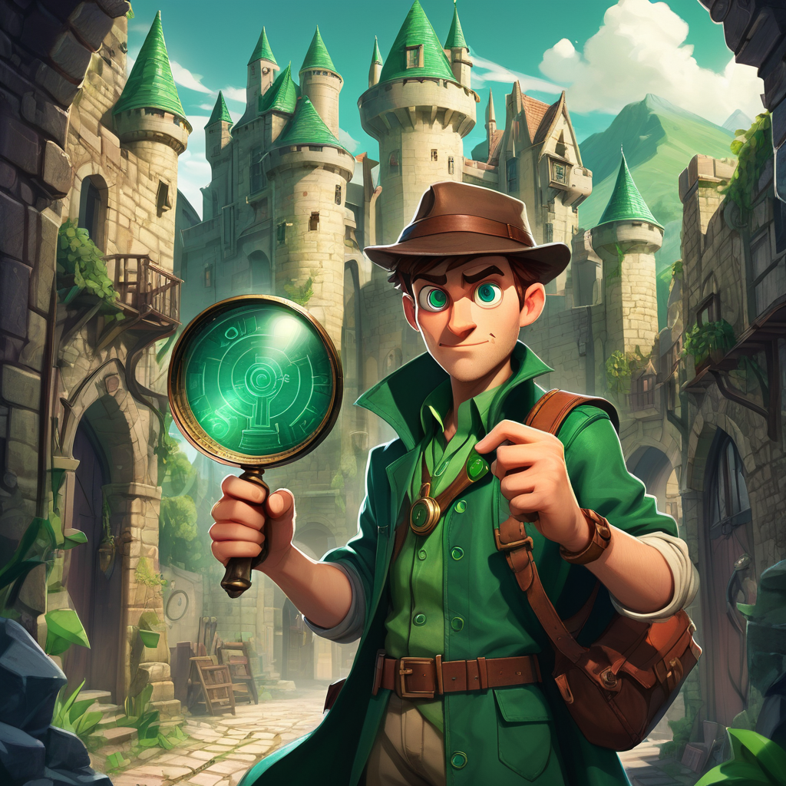

# EspioQuest: The Emerald Cipher

EspioQuest is a desktop quiz-adventure game built with C++ and Qt Widgets. Set in the Scottish Highlands, the game challenges players to answer timed questions, manage limited hints and skips, and uncover the mystery of the Emerald Cipher.

<p align="center">
  
</p>

## Overview

Players select a difficulty level and complete a ten-question quiz while racing against the clock. Questions include multiple-choice and true-or-false formats, with feedback, scoring, hints, skips, and difficulty-based time limits.

The game combines a narrative introduction with interactive quiz systems, animated transitions, custom progress indicators, and score-based results.

## Features

- Easy, Medium, and Hard difficulty levels
- Ten-question quiz sessions
- Multiple-choice and true-or-false questions
- Randomised question selection
- Timed gameplay with difficulty-based limits
- Score tracking and final performance feedback
- Limited hints and question skips
- Help feature unlocked after consecutive correct answers
- Animated narrative introduction with a skip option
- Custom circular timer and progress display
- Qt resource system for portable visual assets

## Difficulty Settings

| Difficulty | Time Limit | Hints | Skips |
|---|---:|---:|---:|
| Easy | 20 minutes | 4 | 6 |
| Medium | 15 minutes | 2 | 4 |
| Hard | 10 minutes | 2 | 0 |

## What This Project Demonstrates

- C++17 development
- Object-Oriented Programming
- Qt Widgets and Qt Designer
- Signals and slots
- Event-driven application logic
- UI state management
- Timers, progress tracking, and scoring
- Question and answer data modelling
- Randomised content selection
- Custom widget development
- Qt resource management

## Main Components

### `MainWindow`

Controls the main application flow, including difficulty selection, quiz presentation, scoring, timers, hints, skips, transitions, and feedback screens.

### `Question`

Represents an individual question, including its text, answer options, correct answer, hint, and question type.

### `QuestionBank`

Stores and manages the available questions and provides random question selection during gameplay.

### `Feedback`

Calculates and supports the final score-based feedback shown to the player.

### `RingProgressBar`

A custom Qt widget used to display the remaining quiz time visually.

## Project Structure

```text
.
├── Resources.qrc                    # Qt visual-resource configuration
├── espoQuest.pro                    # qmake project configuration
├── main.cpp                         # Application entry point
├── mainwindow.cpp                   # Main game and interface logic
├── mainwindow.h
├── mainwindow.ui                    # Qt Designer interface
├── question.cpp                     # Question model implementation
├── question.h
├── questionbank.cpp                 # Question-bank implementation
├── questionbank.h
├── feedback.cpp
├── feedback.h
├── ringprogressbar.cpp              # Custom circular progress widget
├── ringprogressbar.h
├── pictures/                        # Visual assets
├── Screenshots and instructions.pdf # Original screenshots and notes
└── .gitignore
```

## Requirements

- A compiler with C++17 support
- Qt with the Widgets module
- Qt Creator or a compatible qmake development environment

SFML is not required. The current portfolio version uses Qt for the interface and Qt's resource system for visual assets.

## Build and Run with Qt Creator

1. Clone or download the repository.
2. Open Qt Creator.
3. Select **Open Project**.
4. Open `espoQuest.pro`.
5. Select a compatible desktop Qt kit.
6. Allow Qt Creator to configure the project.
7. Build and run the application.

The visual assets are bundled through `Resources.qrc`, so no image paths need to be changed manually.

## Build with qmake

From the repository root:

```bash
qmake espoQuest.pro
make
```

The generated executable or application bundle will depend on your operating system and selected Qt kit.

Qt Creator is the recommended way to configure and run the project.

## Current Portfolio Version

The original project included an SFML-based audio system that depended on machine-specific file paths. That dependency has been removed from this version to improve portability and keep the repository focused on the quiz, interface, scoring, timer, and gameplay systems.

The visual assets are now stored directly in the repository and loaded through the Qt resource system.

## Current Limitations

- Audio is not included in the portfolio version.
- Questions are currently stored directly in the C++ source.
- Automated tests have not yet been added.
- The interface was designed primarily for a large desktop window.
- The original screenshots PDF may contain setup information that predates the current repository structure.

Use this README rather than the legacy PDF for current setup instructions.

## Possible Future Improvements

- Move question data into JSON or a database
- Add unit tests for question selection and scoring
- Introduce a CMake build configuration
- Improve responsive layout support
- Add persistent high scores
- Separate the main interface logic into smaller components
- Add properly licensed sound effects and music

## Author

Developed as a C++ and Qt portfolio project by **Aphiwe Mzulwini**.

- GitHub: [fierce-bri](https://github.com/fierce-bri)
- LinkedIn: [Aphiwe Mzulwini](https://www.linkedin.com/in/aphiwe-mzulwini-310214318)
